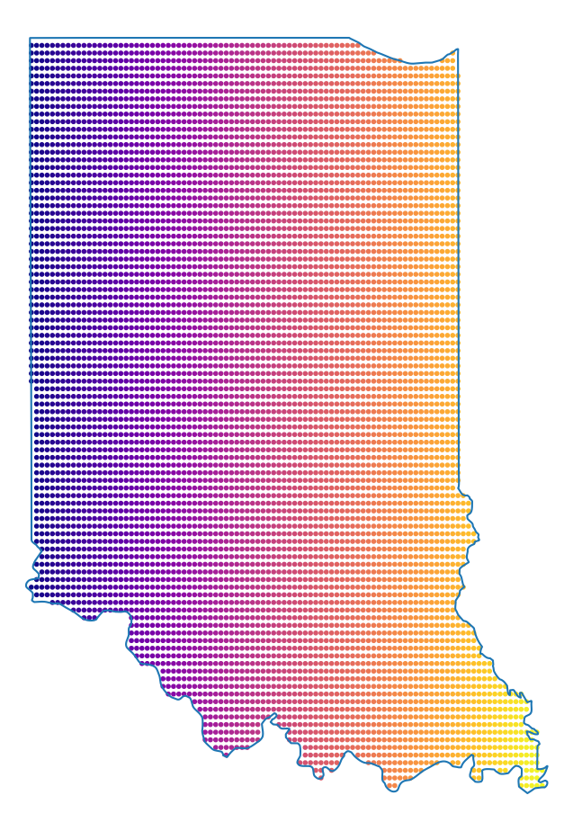

# Riemman Mapper

## Compute Riemann Maps for Simple Closed Curves

The goal here is, roughly, to implement the computational method
described in [Bell's
book](https://www.crcpress.com/The-Cauchy-Transform-Potential-Theory-and-Conformal-Mapping-2nd-Edition/Bell/p/book/9781498727204)
for computing Riemann maps. This method was initially described
elsewhere, however, I first encountered it through the above book. The
method is based upon solving the Kerzman-Stein equation and requires
computing the Garabedian and Szego Kernels. The relationship between
these two kernels is ultimately used compute the Riemann map.

The implementation provided in this project is fairly sketchy and
could be vastly improved - however, I'm not up to doing that right
now. As a method for faithfully computing Riemann maps, my
implementation is pretty much an utter failure. However, that wasn't
really my goal when I started this project... Instead, I really just
wanted a way to take a simple planar curve and shove its interior
inside of the unit disc. In particular, I wanted to map Indiana into
the unit disc. 

In the future, I would like to decrease some of the obvious
inaccuracies that my implementation suffers from. I imagine my
implementation could be improved by using higher quadratures when
computing integrals. Moreover, I would like to add a method to
approximate the inverse of the Riemann map, so that I can map from the
disk onto a given domain. In particular, I'd like to be able to map
Indiana onto a potato shaped domain.

## An example 

Here's a map of Indiana into the unit disc. Note that there are points
from inside indiana that do not fall inside the disk. This shouldn't
happen, and suggests that this implementation has a good amount of
room for improvement. (n = 5000 points are used on the domain
boundary)

<div

